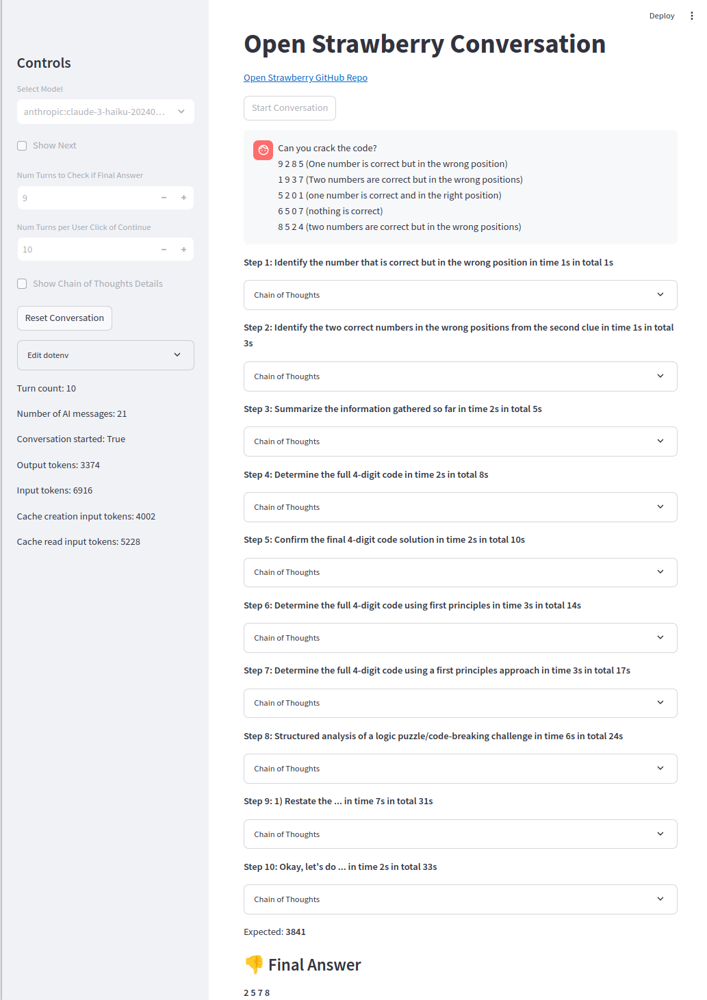

# open-strawberry

A proof-of-concept in development for open-source implementation inspired by OpenAI's Strawberry algorithm.

If you want to support the project, turn ★ into ⭐ (top-right corner) and share it with your friends.

With enough support, my employer might pay for compute to generate data and fine-tune models.

Contributions very welcome!

## Installation

```bash
pip install -r requirements.txt
```

## Usage

For demonstration purposes, Anthropic API is used, but OpenAI can be used to connect with vLLM or ollama for OSS models.

UI:
```bash
export ANTHROPIC_API_KEY=your_api_key
streamlit run src/app.py
```
or using CLI:
```bash
export ANTHROPIC_API_KEY=your_api_key
python src/open_strawberry.py
```

The project is in its initial stages to explore generation of reasoning traces for specific problems as proof of concept.



## Background

open-strawberry is based on speculations about OpenAI's Strawberry, a refined search-generation algorithm for generating and verifying training data.

This project aims to recreate a similar system using open-source tools and methodologies.

### Key Concepts

- **Q***: A hypothetical primordial search-generation algorithm developed by OpenAI to generate training data.
- **Strawberry**: An advanced search-generation algorithm by OpenAI for generating and verifying training data.
- **Orion**: A class of models fine-tuned on Strawberry data, including o1-mini, o1-preview, o1, o1-ioi, etc. [1]

## Proposed Methodology

1. Bootstrap using SFT-instruction tuned models and their chat history.
2. Implement a prompt system that guides the LLM to take incremental steps towards a solution.
3. Generate multi-turn chat reasoning traces, periodically checking for a final answer.
4. Employ a verification system to check for errors in the chat history.
5. Generate multiple reasoning traces per problem.
6. Apply this process to a large set of problems with verifiable ground truths.
7. Select correct reasoning traces for each problem.
8. Fine-tune a model using the selected reasoning traces using DPO or NLHF.

## Speculations

1. MCTS, ToT, agents, etc. not required at training or inference time.
2. Bootstrapping is key (i.e. progressive learning):
   * Identify problems the instruct model can do barely with strong CoT and high temperature for some number of fixed (e.g. 20) repeats.
   * Fine-tune the model on these reasoning traces with mix of other data as usual.
   * Use this model to generate reasoning traces for slightly harder problems this new model can barely do.
   * Repeat until the model can do the hardest problems, and the scope of reasoning traces as consumed more types of problems (but not all types since not always required).
3. Human labeling or verification of reasoning traces are not required.
4. Verification models are not required.
5. Emphasize first principles thinking.
6. Randomized useful CoT prompts for "next" from user when generating reasoning traces (e.g. not just next but "are you sure?" "any mistakes?" "how would you verify your answer?")
7. Sometimes ask if the model is confident about an answer.  If so, then ask it to place that answer in <final_answer> xml tags.  If so, then terminate the reasoning trace generation.
8. RLHF is not strictly required, just DPO or NLHF, where good reasoning traces are used for positive reward and bad reasoning traces are used for negative reward.

## Project Goals

1. Generate reasoning traces using the proposed approach.
2. Fine-tune a model on the generated reasoning traces.
3. Evaluate the performance and compare it with existing models.

## Current Status

This project is in its initial stages. Results and comparisons will be added as they become available.

TODO:
- [x] Setup basic anthropic case with prompt caching
- [x] Setup basic streamlit app to easily monitor outputs
- [x] Look for community support
- [ ] Improve system prompt, vary it as well
- [ ] Add to next prompts other [CoTs](https://github.com/h2oai/h2ogpt/blob/main/src/prompter.py#L2060-L2077)
- [ ] Add verifier that samples window of history and separately critiques the assistant output
- [ ] Use existing datasets with ground truth to identify problems for which CoT achieves success after some trials
- [ ] Harvest CoT-friendly prompts and collect positive and negative reasoning traces
- [ ] Fine-tune with DPO including with mix of normal data as well with similar distribution 
- [ ] Repeat on next round of CoT-friendly prompts excluding original prompts, so can bootstrap
- [ ] Fine-tune on top of Fine-tune including with mix of normal data as well with similar distribution
- [ ] Repeat overall until bootstrap-repeat ones way to a smarter model

## Contributing

We welcome contributions from the community. Please see our [CONTRIBUTING.md](CONTRIBUTING.md) file for guidelines on how to participate.

## About the Author

Jonathan McKinney is the Director of Research at H2O.ai with a background in astrophysics and machine learning. His experience includes:

- Former Astrophysics Professor at UMD [B1][B2][B3][B4]
- 7 years of experience with AutoML products at H2O.ai [B5][B6]
- Recent work on fine-tuning LLMs, RAG, and AI Agents (h2oGPT) [B7][B8]

## Disclaimer

This project is speculative and based on publicly available information about OpenAI's work. It is not affiliated with or endorsed by OpenAI.

## References

[1] https://openai.com/index/learning-to-reason-with-llms/

[B1] https://umdphysics.umd.edu/about-us/news/department-news/697-jon-mckinney-publishes-in-science-express.html

[B2] https://umdphysics.umd.edu/academics/courses/945-physics-420-principles-of-modern-physics.html

[B3] https://www.linkedin.com/in/jonathan-mckinney-32b0ab18/

[B4] https://scholar.google.com/citations?user=5L3LfOYAAAAJ&hl=en

[B5] https://h2o.ai/company/team/makers/

[B6] https://h2o.ai/platform/ai-cloud/make/h2o-driverless-ai/

[B7] https://arxiv.org/abs/2306.08161

[B8] https://github.com/h2oai/h2ogpt

[P0] Chain-of-Thought Prompting Elicits Reasoning in Large Language Models: https://arxiv.org/abs/2201.11903

[P1] STaR: Bootstrapping Reasoning With Reasoning: https://arxiv.org/abs/2203.14465

[P2] Let's Verify Step by Step: https://arxiv.org/abs/2305.20050

[P3] Quiet-STaR: Language Models Can Teach Themselves to Think Before Speaking: https://arxiv.org/abs/2403.09629

[P4] Think before you speak: Training Language Models With Pause Tokens: https://arxiv.org/abs/2310.02226

[P5] Nash Learning from Human Feedback: https://arxiv.org/abs/2312.00886
